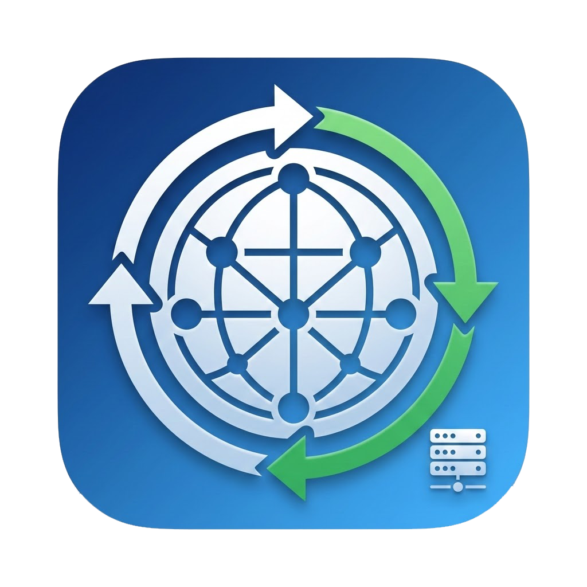

<p align="center">
  
</p>

<h1 align="center">DNSSwitcher</h1>

<p align="center">
   <strong>A lightweight macOS menu bar app for DNS profile switching</strong><br>
   <em>No Dock icon. It lives entirely in your menu bar.</em>
</p>

## Features

- Switch DNS profiles with two clicks from the menu bar
- Ships with Cloudflare, Quad9, and AdGuard profiles
- Create custom profiles with any DNS servers
- "Off (DHCP)" resets to automatic DNS
- Apply to all network interfaces or just the primary one
- Launch at login support
- IPv4 and IPv6 server validation

## Built-in DNS profiles

| Profile | Primary | Secondary |
|---|---|---|
| Cloudflare | `1.1.1.1` | `1.0.0.1` |
| Quad9 | `9.9.9.9` | `149.112.112.112` |
| AdGuard | `94.140.14.14` | `94.140.15.15` |

Choose Off (DHCP) to clear these and return to your network's automatic DNS.

## Installation

### Homebrew

```bash
brew tap kacigaya/tap
brew install --cask dnsswitcher
# Remove quarantine attribute to avoid Gatekeeper warnings
xattr -d com.apple.quarantine /Applications/DNSSwitcher.app
```

### Manual

1. Download the latest DMG from [Releases](https://github.com/kacigaya/dns-switcher/releases)
2. Drag DNS Switcher to Applications
3. Run `xattr -d com.apple.quarantine /Applications/DNSSwitcher.app`
4. Launch the app. A network icon appears in the menu bar.

### Build from source

```bash
git clone https://github.com/kacigaya/dns-switcher.git
cd dns-switcher
make app
open ".build/apple/Products/Release/DNSSwitcher.app"
```

## Usage

Click the network icon in the menu bar to see your DNS profiles. Select one to apply it. Choose Off (DHCP) to reset to automatic DNS. Open Preferences to manage profiles and settings.

## Why does it ask for my admin password?

macOS requires administrator privileges to change DNS settings via `networksetup`. The app uses AppleScript's `with administrator privileges` to prompt for your password when needed. No credentials are stored.

## Requirements

- macOS 13.0 (Ventura) or later
- Building from source requires Xcode 26 or later on macOS 15.6 or later
