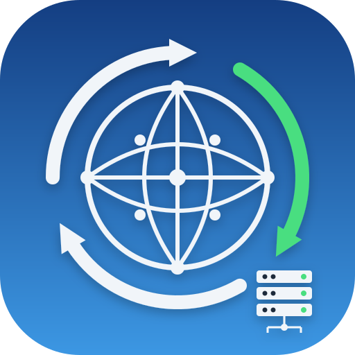

<p align="center">
  
</p>

<h1 align="center">DNSSwitcher</h1>

<p align="center">
   <strong>A lightweight macOS menu bar app for DNS profile switching</strong><br>
   <em>No Dock icon. It lives entirely in your menu bar.</em>
</p>

<p align="center">
  <a href="https://www.swift.org"></a>
  <a href="https://www.apple.com/macos"></a>
  <a href="https://brew.sh"></a>
  <a href="https://github.com/kacigaya/dns-switcher/blob/main/LICENSE"></a>
</p>

## Features

- Switch DNS profiles with two clicks from the menu bar
- Ships with Cloudflare, Quad9, and AdGuard profiles
- Create custom profiles with any DNS servers
- "Off (DHCP)" resets to automatic DNS
- Apply to all network interfaces or just the primary one
- Launch at login support
- IPv4 and IPv6 server validation
- One administrator prompt per change, no stored credentials

## Built-in DNS profiles

| Profile | Primary | Secondary |
|---|---|---|
| Cloudflare | `1.1.1.1` | `1.0.0.1` |
| Quad9 | `9.9.9.9` | `149.112.112.112` |
| AdGuard | `94.140.14.14` | `94.140.15.15` |

Choose Off (DHCP) to clear these and return to your network's automatic DNS.

## Installation

### Homebrew

```bash
brew tap kacigaya/tap
brew install --cask dnsswitcher
# Remove quarantine attribute to avoid Gatekeeper warnings
xattr -d com.apple.quarantine /Applications/DNSSwitcher.app
```

### Manual

1. Download the latest DMG from [Releases](https://github.com/kacigaya/dns-switcher/releases)
2. Drag DNS Switcher to Applications
3. Run `xattr -d com.apple.quarantine /Applications/DNSSwitcher.app`
4. Launch the app. A network icon appears in the menu bar.

### Build from source

```bash
git clone https://github.com/kacigaya/dns-switcher.git
cd dns-switcher
make app
open ".build/apple/Products/Release/DNSSwitcher.app"
```

## Usage

Click the network icon in the menu bar to see your DNS profiles. Select one to apply it. Choose Off (DHCP) to reset to automatic DNS. Open Preferences to manage profiles and settings.

## How it works

The app never talks to a DNS resolver itself. It shells out to macOS's own
`networksetup` tool to read and write the DNS servers of each connected network
service, then flushes the resolver cache with `dscacheutil -flushcache`.

Reading the current state spawns several `networksetup` processes, so it happens
off the main thread: the menu opens instantly from the last known state and
updates in place once the fresh read lands.

Source layout:

| Path | Contents |
|---|---|
| `Sources/DNSSwitcher/App` | App entry point, delegate, settings window |
| `Sources/DNSSwitcher/MenuBar` | Status item and menu construction |
| `Sources/DNSSwitcher/DNS` | `networksetup` wrappers, DNS state snapshot, IP parsing |
| `Sources/DNSSwitcher/Models` | `DnsProfile` and its validation rules |
| `Sources/DNSSwitcher/Storage` | `UserDefaults`-backed profile store |
| `Sources/DNSSwitcher/UI` | SwiftUI settings screen and Liquid Glass helpers |

## Development

```bash
swift test          # unit tests
make app            # build and assemble DNSSwitcher.app
make dmg            # build the distributable disk image
```

CI runs the tests and the bundle build on every pull request. Tagging `vX.Y.Z`
builds the DMG, publishes the release, and updates the Homebrew cask checksum.

## Why does it ask for my admin password?

macOS requires administrator privileges to change DNS settings via `networksetup`. The app first tries without elevation, and only when that fails does it ask, using AppleScript's `with administrator privileges`. All interfaces that need elevation are changed in a single privileged command, so you are asked at most once per switch. No credentials are stored.

## Requirements

- macOS 13.0 (Ventura) or later
- Building from source requires Xcode 26 or later on macOS 15.6 or later
